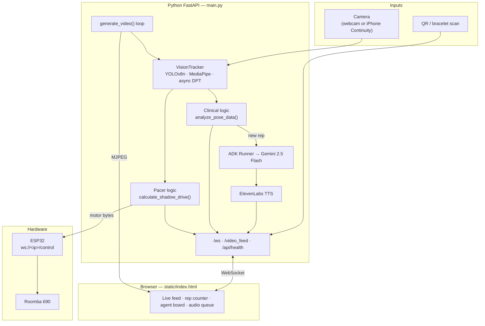
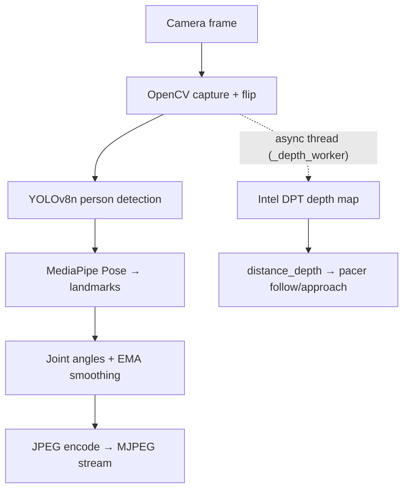
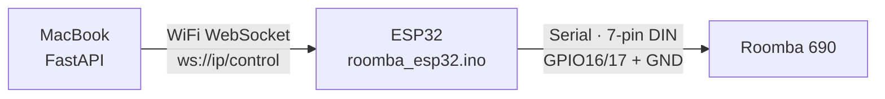

# BOWSER — Boss-Oriented Wellness & Stimulated Exercise Robot

> **"Turn pediatric rehab into a clinical boss fight."**

**HackUSF 2026** — An autonomous, AI-powered pediatric physical therapy companion that tracks movement, counts reps, coaches kids by name, and physically paces sessions with a modified Roomba. **Winner of the Google Cloud Challenge (1st place, unanimous judge vote).**

---

## Inspiration

Physical therapy can feel repetitive and discouraging for kids, which leads to lower engagement and missed progress. We wanted to reimagine rehab as something children actually *want* to do — a playful "boss battle" where movement, voice feedback, and robotic presence happen in real time.

BOWSER was inspired by the idea that clinical outcomes and fun don't have to compete. Instead of a child staring at a wall doing squats alone, they face a live therapy companion that sees them, speaks to them, counts their reps, and moves with them through the session.

---

## What It Does

BOWSER is a real-time pediatric therapy system that turns exercises into an interactive game loop.

- **Live vision dashboard** — MJPEG camera feed with skeletal overlay, person detection, and session telemetry
- **Patient onboarding** — QR / bracelet scan loads a therapy profile (exercise goal, target reps, voice ID)
- **Rep + form tracking** — deterministic clinical logic counts squats, arm raises, and side reaches from pose angles
- **AI coaching** — Gemini (via Google ADK Runner) generates short, encouraging dialogue tied to live session context
- **Voice feedback** — ElevenLabs TTS with a custom cloned voice, streamed to the browser over WebSocket
- **Autonomous pacing** — Roomba + ESP32 follow/approach logic uses spatial tracking and depth for distance-aware movement
- **Agent collaboration panel** — live trace of patient, clinical, director, pacer, and audio agent events for demo transparency

The **dashboard UI** (`static/index.html`) handles QR scanning, audio playback, session scorecard, and health pills. The **Python backend** (`main.py`) owns the video loop, clinical math, ADK invocation, TTS generation, and robot command authority.

---

## Architecture



### The Golden Loop

1. Therapist scans a patient QR code (or taps a demo profile) on the dashboard
2. Backend loads patient record → resets clinical state → creates a new ADK session
3. Gemini generates a personalized greeting → ElevenLabs TTS → WebSocket audio event
4. `generate_video()` runs every frame: YOLO person detect → MediaPipe pose → angle extraction (EMA-smoothed)
5. `analyze_pose_data()` applies hysteresis thresholds; on new rep, director agent triggers ADK coaching
6. Assistant returns `[COMMAND] dialogue` → TTS (4s throttle) → dashboard updates
7. Pacer agent computes `drive velocity,turn` from `center_x`, shoulder width, and async depth samples
8. ESP32 bridge sends motor bytes to Roomba; emergency stop if person lost or too close

---

## Tech Stack

| Layer | Tech | Purpose |
|---|---|---|
| Backend | Python FastAPI | WebSocket server, MJPEG stream, orchestration |
| Runtime | Uvicorn, asyncio | Async ADK + TTS + broadcast loop |
| Computer Vision | OpenCV, MediaPipe Pose, YOLOv8n | Capture, pose landmarks, person detection |
| Depth | Intel DPT (`dpt-large`) via Hugging Face Transformers | Async distance estimation for follow logic |
| Clinical Logic | Deterministic Python (`clinical.py`) | Hysteresis rep counting + 0.8s debounce |
| Agents | Google ADK (`google-adk`) | Four agent definitions; Runner invokes assistant only |
| LLM | Gemini 2.5 Flash | Coaching dialogue + greetings |
| TTS | ElevenLabs REST (`httpx`) | Custom voice MP3 generation |
| Frontend | HTML5, CSS3, JavaScript | Single-page dashboard + audio queue |
| QR | jsQR | Automatic patient scan from video feed |
| Animation | GSAP | UI motion / polish |
| Streaming | MJPEG (`multipart/x-mixed-replace`) | Low-latency annotated video to browser |
| Robotics | ESP32 WebSocket bridge | Roomba motor commands over WiFi |
| Hardware | Roomba 690, ESP32, 7-pin mini-DIN serial | Physical therapy pacer platform |

---

## Project Structure

```
Bowser/
├── README.md
├── EXAMPLE_README.md          # Reference template (APEX / Hacklytics)
├── requirements.txt
├── main.py                    # FastAPI app, WebSocket, video loop, ADK orchestration
├── yolov8n.pt                 # YOLOv8 nano weights (auto-downloaded if missing)
│
├── core/
│   ├── config.py              # GOOGLE_API_KEY, ELEVENLABS_API_KEY from .env
│   ├── vision.py              # Production CV pipeline (YOLO + MediaPipe + async DPT)
│   ├── vision_sota.py         # Experimental SOTA engine (RTMPose, YOLO11-seg) — not wired to main
│   ├── audio.py               # ElevenLabs TTS via direct HTTP
│   ├── hardware.py            # ESP32 WebSocket motor bridge
│   └── agents/
│       ├── patient.py         # Patient record agent + mock DB lookup
│       ├── clinical.py        # Rep-counting logic (hysteresis + cooldown)
│       ├── assistant.py       # Gemini coaching agent (ADK Runner target)
│       ├── pacer.py           # Shadow drive + intent → Roomba translation
│       └── __init__.py
│
├── static/
│   ├── index.html             # Main therapy dashboard
│   ├── remote.html            # Manual D-pad remote (secondary screen)
│   └── audio/                 # Generated ElevenLabs MP3s (gitignored)
│
└── firmware/
    └── roomba_esp32.ino       # ESP32 firmware: WiFi + WebSocket → Roomba serial
```

---

## Perception Pipeline



### Performance (measured on Apple M3 Pro, CPU)

| Component | Latency | Throughput |
|---|---|---|
| **End-to-end `process_frame()`** | ~68 ms avg (p50 67 ms, p95 77 ms) | **~15 FPS** |
| YOLOv8n only | ~38 ms | ~26 FPS |
| MediaPipe Pose only | ~14 ms | ~70 FPS |
| YOLO + MediaPipe combined | ~52 ms | ~19 FPS (theoretical) |
| JPEG encode | ~4 ms | ~260 FPS |
| Intel DPT depth worker | async, ~10 Hz loop | does not block main perception loop |

All CV inference runs **on-device** — no cloud offload for perception.

---

## Clinical Rep Counting

`analyze_pose_data()` in `core/agents/clinical.py` uses **hysteresis thresholds** so reps only count on full range-of-motion cycles, plus a **0.8s cooldown** between counted reps.

| Exercise | Enter threshold | Exit threshold | Angle source |
|---|---|---|---|
| Squats | knee angle < 100° | knee angle > 150° | `squat_angle` |
| Arm Raises | arm angle > 140° | arm angle < 60° | `arm_angle` |
| Side Reach | arm angle > 120° | arm angle < 55° | `arm_angle` |

### Validation (scripted angle sequences)

| Metric | Result |
|---|---|
| Test cases | 13 (valid reps + shallow/incomplete negatives) |
| Case accuracy | **100%** |
| Precision / recall | **100%** / **100%** |

This validates the **logic layer** on synthetic angle streams. Live accuracy depends on pose landmark quality and camera framing.

---

## Multi-Agent System (Google ADK)

Four ADK `Agent` definitions coordinate the session. At runtime, patient/clinical/pacer logic runs as **deterministic function calls** in the video loop; only the **assistant** is invoked through the ADK `Runner`.

| Agent | Role | Runtime |
|---|---|---|
| `patient_agent` | Load therapy profile on scan | Direct `get_patient_record()` call |
| `clinical_agent` | Track reps and exercise type | Direct `analyze_pose_data()` per frame |
| `assistant_agent` | Gemini coaching dialogue | **ADK Runner** (`assistant_runner.run_async`) |
| `pacer_agent` | Translate spatial data → drive commands | Direct `calculate_shadow_drive()` per frame |
| `director_agent` *(trace label)* | Orchestrates ADK prompts, parses `[COMMAND]` prefix | `trigger_assistant_update()` in `main.py` |
| `audio_agent` *(trace label)* | ElevenLabs TTS generation + playback events | `generate_bowser_audio()` + WebSocket push |

### Agent-to-Agent Handoff

When the assistant returns a movement command like `[SPIN]`, the director can **override** the pacer's continuous shadow-drive output via `translate_intent_to_drive()` — visible in the agent trace as a pacer override event.

LLM calls are rate-limited with a **2-slot semaphore** (`assistant_slots`) and a **4s TTS throttle** to prevent audio spam during rapid rep events.

---

## API

### REST

| Endpoint | Method | Description |
|---|---|---|
| `/` | GET | Main dashboard (`static/index.html`) |
| `/remote` | GET | Manual D-pad remote control page |
| `/video_feed` | GET | MJPEG annotated camera stream |
| `/api/health` | GET | Vision/audio/LLM readiness + agent status |
| `/api/session/summary` | GET | Reps, completion %, elapsed time, patient goal |
| `/api/camera/{index}` | POST | Switch camera index (or `"off"`) |
| `/api/esp32` | POST | Set ESP32 WebSocket URL at runtime |
| `/api/esp32/toggle` | POST | Pause/resume robot following |
| `/api/follow/unlock` | POST | Emergency unlock + stop |

### WebSocket

| Endpoint | Direction | Payload |
|---|---|---|
| `ws://localhost:8000/ws` | Server → Client | Full session state: patient, clinical, dialogue, roomba, audio_url, audio_event_id, agent_status, agent_trace, health, summary |
| `ws://localhost:8000/ws` | Client → Server | `{"action": "scan_bracelet", "patient_id": "akhilesh"}` |
| `ws://localhost:8000/ws` | Client → Server | `{"action": "kid_speech", "text": "I'm tired!"}` |
| `ws://localhost:8000/ws` | Client → Server | `{"action": "stop"}` |

### Demo Patient Profiles

| ID | Name | Exercise |
|---|---|---|
| `akhilesh` | Akhilesh | Arm Raises ×20 |
| `bailey` | Bailey | Squats ×20 |
| `john` | John | Side Reach ×20 |

---

## Setup & Run

### Prerequisites

- Python 3.9+ (3.10+ recommended for full ADK MCP support)
- Webcam or iPhone Continuity Camera
- macOS/Linux (developed on Apple Silicon)
- Optional: ESP32 flashed with `firmware/roomba_esp32.ino` + Roomba 690

### Backend

```bash
# Clone and enter project
cd Bowser

# Create virtual environment
python3 -m venv venv
source venv/bin/activate

# Install dependencies
pip install -r requirements.txt

# Depth model requires transformers (not pinned in requirements.txt)
pip install transformers pillow torch

# YOLO weights download automatically on first run if missing
```

### Environment Variables

Create `.env` in the project root:

```env
GOOGLE_API_KEY=your_gemini_key_here
ELEVENLABS_API_KEY=your_elevenlabs_key_here

# Optional — ESP32 WebSocket endpoint for Roomba control
ESP32_WS_URL=ws://192.168.1.100/control
```

### Start Server

```bash
uvicorn main:app --host 0.0.0.0 --port 8000 --reload
```

- **Dashboard:** http://localhost:8000
- **Remote control:** http://localhost:8000/remote
- **Health check:** http://localhost:8000/api/health
- **Video feed:** http://localhost:8000/video_feed

### Demo Flow

1. Open the dashboard and allow camera access
2. Click a patient button (or scan a QR code pointing to `akhilesh`, `bailey`, or `john`)
3. Perform the assigned exercise in frame — watch reps increment
4. Hold a **T-pose** to lock follow target (if robot connected)
5. Session completes automatically when target reps are reached

---

## Hardware Setup



1. Flash `firmware/roomba_esp32.ino` to ESP32 (update WiFi credentials)
2. Wire ESP32 UART2 to Roomba serial port
3. Set `ESP32_WS_URL` in `.env` or POST to `/api/esp32`
4. Backend sends single-byte commands: `0`=forward, `1`=back, `2`=left, `3`=right, `4`=stop
5. Firmware auto-stops after 3s of command silence (safety timeout)

If ESP32 is unreachable, the backend runs in **simulation mode** — all logic works, motor commands are logged but not delivered.

---

## Design System: "Clinical Luxury"

- Dark glassmorphism cards with gold (`#dfb571`) and violet (`#a88ff2`) accents
- Playfair Display headlines + Inter body + JetBrains Mono for telemetry
- Agent collaboration board with live event trace
- Session scorecard with completion ring and health pills (vision / audio / LLM / robot)

---

## Honest Assessment

| Aspect | Status | Notes |
|---|---|---|
| On-device CV at ~15 FPS | **Correct** | Measured end-to-end on M3 Pro CPU |
| Async depth for following | **Correct** | DPT runs off main thread; feeds pacer distance logic |
| Hysteresis rep counting | **Correct** | 100% on 13 scripted test cases |
| ADK multi-agent architecture | **Correct** | Four agent definitions with clear separation of concerns |
| Only assistant uses ADK Runner | **Limitation** | Patient/clinical/pacer are direct function calls, not parallel LLM agents |
| Depth is not patient gating | **Limitation** | No Z-buffer / distance filter to ignore background people; YOLO handles person detect |
| `vision_sota.py` not in production | **Limitation** | RTMPose + YOLO11-seg + Depth V2 engine exists but is not wired to `main.py` |
| Browser audio autoplay | **Limitation** | ElevenLabs MP3s generate correctly; playback can be blocked by browser policy (Web Speech API fallback exists) |
| Mock patient database | **Limitation** | Three hardcoded profiles in `patient.py`, not a real EHR integration |
| ESP32 connection fragile | **Limitation** | Requires same WiFi network; 2s connect timeout; drops to simulation mode |
| Pitch vs. production depth model | **Note** | Marketing copy references Depth Anything 3; production uses Intel DPT-Large |

### What Would Improve It

1. **Wire `vision_sota.py`** or GPU-accelerate perception to push FPS above 25 on Apple Silicon
2. **True ADK orchestration** — invoke clinical/patient agents through Runner for full agentic tracing
3. **Live rep benchmark** — record labeled exercise videos to report real-world counting accuracy
4. **Depth-based person selection** — filter to nearest patient when multiple people are in frame
5. **Server-side audio streaming** — bypass browser autoplay restrictions for reliable ElevenLabs playback
6. **Safety state machine** — startup with `follow_enabled=false`, explicit arming flow before motor authority

---

## What's Next for BOWSER

- Clinical trial–style rep accuracy benchmarking with labeled video
- Therapist dashboard for session history and progress over time
- FHIR / EHR integration for real patient records
- On-device GPU inference (CoreML / MPS) for 30+ FPS perception
- Multi-patient depth gating in crowded clinic rooms
- Safety-certified motor control with hardware e-stop

Long-term, we want BOWSER to become a deployable pediatric therapy companion that makes rehab feel like progress — not punishment.

---

## Software Contributors

| Name | GitHub |
|---|---|
| **Akhilesh Reddy Mallu** | [@Akhileshreddym](https://github.com/Akhileshreddym) |

**Google Cloud Challenge — 1st Place (unanimous judge vote).**

---

## License

Hackathon project — all rights reserved by the BOWSER team.
